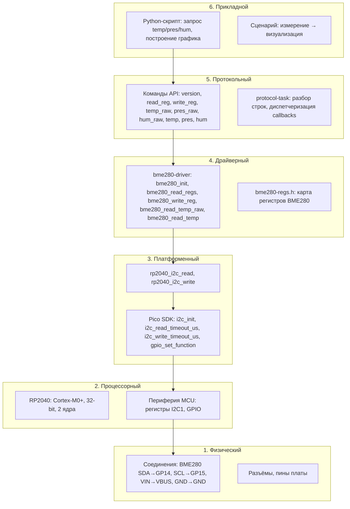

---
занятие:
  - "[[Как абстрагироваться от железа]]"
дата: 2026-03-10
tags:
  - занятие5
  - теория
  - схема
---

# Схема уровней абстракции на основе заданий занятия 4

Схема построена по [[Драйвер bme280|заданиям]] занятия «[[Как работать с внешней периферией]]»: драйвер BME280, команды API, Python-скрипт построения графика.

## Диаграмма уровней



## Таблица: уровень — задание — артефакты

| Уровень | Задание | Артефакты в проекте |
|---------|---------|---------------------|
| **6. Прикладной** | [[График измерений через Python]] | Python-скрипт, цель «измерить и построить график» |
| **5. Протокольный** | [[Проект с использованием библиотеки]], команды в API | `protocol-task`: парсинг `read_reg`, `temp_raw`, `temp` и т.д. |
| **4. Драйверный** | [[Драйвер bme280]], [[Инициализация и измерение через драйвер]], [[Физические величины в СИ]] | `bme280-driver`, `bme280-regs.h`, `temp_raw`/`temp` |
| **3. Платформенный** | [[Драйвер bme280]] п.18–22 | `i2c_init`, `rp2040_i2c_read/write`, Pico SDK |
| **2. Процессорный** | Выбор платформы | RP2040, Cortex-M0+, 32-bit, 2 ядра |
| **1. Физический** | [[Драйвер bme280]] п.24 | BME280 SDA→GP14, SCL→GP15, VIN→VBUS, GND→GND |

## Поток зависимостей

```
Python «temp»  →  protocol «temp»  →  bme280_read_temp()  →  rp2040_i2c_read()
                                                              ↓
                                                    i2c_read_timeout_us(i2c1, 0x76, ...)
                                                              ↓
                                                    Регистры I2C1, шина на GP14/15
                                                              ↓
                                                    Физическое соединение с BME280
```

Верхние уровни не обращаются к нижележащим напрямую: Python не вызывает `bme280_read_regs`, protocol не трогает регистры I2C.
